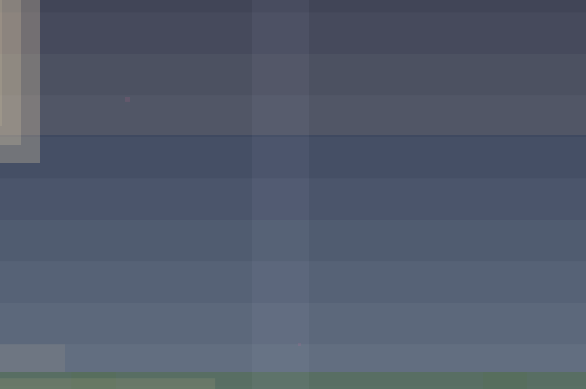
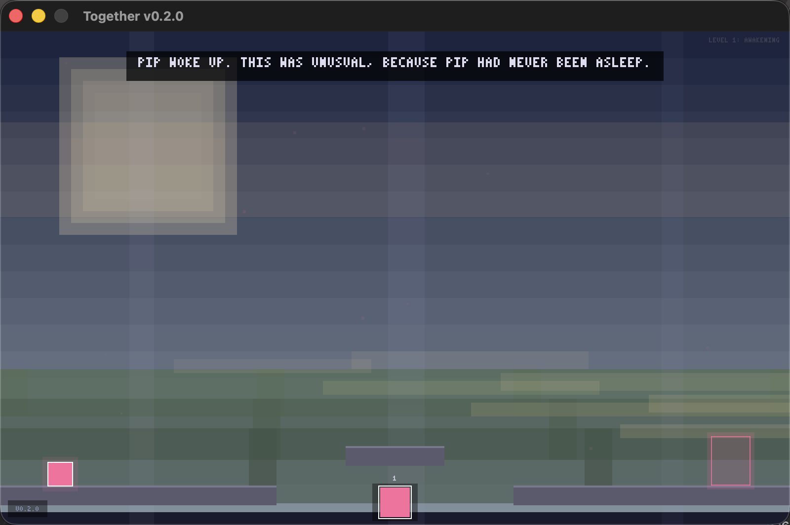

# Together (Nim) `v0.3.0`

*"Pip woke up. This was unusual, because Pip had never been asleep."*

A narrative puzzle-platformer about colored rectangles discovering consciousness, friendship, and what it means to belong. Rebuilt from the ground up in **Nim** with **Windy** for the window loop, **SDL2** for audio/controllers, **Boxy** for the world render path, and **Silky** for the UI layer.

Inspired by *Thomas Was Alone*. Originally built in TypeScript at [candycomp.com](https://candycomp.com), now reimagined as a native desktop game orchestrated by [Scriptorium](https://github.com/Wal33D/scriptorium).

Current state: a 12-level campaign with Felix and Ivy in the playable arc, ambient procedural music, improved jump feel, layered atmospheric backdrops, and a fresh Windy/Silky UI pass for menus and overlays.

## Current Build

- Version: `0.3.0`
- Runtime stack: Windy for windowing/input, SDL2 for audio and controllers, Boxy for world rendering, Silky for UI
- Campaign: 12 playable levels
- Recent improvements: Windy/Silky UI migration, jump buffering and coyote time polish, procedural ambient music, atmospheric backdrops, gameplay particles, fullscreen toggle with saved preference

## Roadmap

The working version-by-version plan from `v0.4.0` through `v0.9.0` lives in [docs/ROADMAP.md](docs/ROADMAP.md).

## Screenshots





## The Family

| Character | Color | Gift |
|-----------|-------|------|
| **Pip** | Pink | Double jump — reaches new heights |
| **Luca** | Yellow | Float — drifts gently through the world |
| **Bruno** | Brown | Heavy — presses buttons, holds things together |
| **Cara** | Light Pink | Wall jump — climbs where others can't |
| **Felix** | Tan | Long coyote time — patient, never rushed |
| **Ivy** | Teal | Graceful fall — lands in peace |

## Controls

| Action | Key |
|--------|-----|
| Move | Arrow keys or A/D |
| Jump | Space |
| Switch character | 1-6 |
| Pause | Escape |
| Fullscreen | F11 |
| Restart level | R |
| Start / Continue | Enter |

## Build & Run

Requires [Nim](https://nim-lang.org/) >= 2.0.0 and [SDL2](https://www.libsdl.org/). The Treeform stack (`boxy`, `windy`, `silky`, `pixie`) is declared in `together.nimble`.

```bash
# Install SDL2 (macOS)
brew install sdl2

# Install Nim SDL2 bindings
nimble install sdl2

# Install project dependencies
nimble install -y

# Build
nim c -o:together -d:release src/together.nim

# Run (macOS — SDL2 needs library path)
DYLD_LIBRARY_PATH=/opt/homebrew/lib ./together

# Run tests
make test
```

## Built with Scriptorium

This game is being developed using [Scriptorium](https://github.com/Wal33D/scriptorium), a git-native agent orchestration system. Scriptorium's Architect breaks the game into areas and tickets, coding agents implement features in parallel worktrees, a review agent checks their work, and passing changes merge to master automatically.

The `scriptorium/plan` branch contains the full planning state — spec, areas, tickets, and their lifecycle.

Thanks to Monofuel on GitHub for creating Orchestrator / Scriptorium and for the underlying workflow that powers this project.

Thanks as well to Monofuel for [Sygnosphere](https://github.com/monofuel/sygnosphere), which Andrew pointed us to as a practical reference for running Boxy world rendering and Silky overlays together in the same Windy/OpenGL frame loop.

## License

MIT
